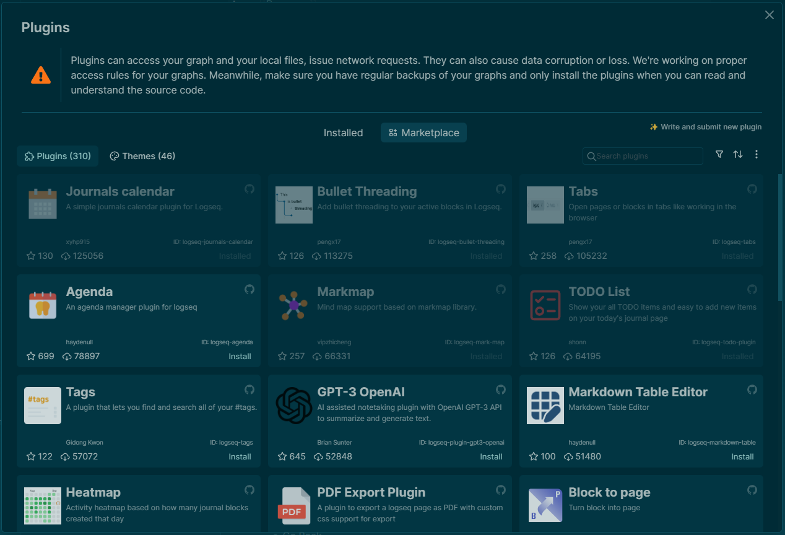

## Meta
Type:: [[Resource]]
Status:: [[Active]] [/[Archive]]
Description:: Logseq Knowledge Resource
Tags:: #Logseq #pkm #learning
title:: Logseq
- ## Books
	- [[Book/Building a Second Brain]]
- ## Web Resources
	- [Carducci's Example Graph](https://github.com/carducci/logseq-demo-graph)
	- [Building A Second Brain Foundation Course](https://building-a-second-brain.circle.so/checkout/building-a-second-brain-foundation?via=matt)
	- [Building a Second Brain Community Membership](https://building-a-second-brain.circle.so/checkout/building-a-second-brain-membership?via=matt)
- ## Videos
	- [OneStutteringMind Playlist](https://www.youtube.com/playlist?list=PLNnZ7rjaL84IFXUPf-XlSrusWgfnvV0ED)
- ## Notes
	- ### Installing Plugins
	  id:: 655a678c-3457-4285-8390-d40ec1018315
		- Plugins are managed using the toolbar at the top-right corner of the Logseq window
			- 
			- Click the puzzle piece icon to access plugins and selecting "plugins"
			- Plugins are available from the "Marketplace"
				- 
				-
			-
	- ### Keyboard Shortcuts
	  collapsed:: true
		- New Line in Current Block #card
			- Shift-enter
		- Go Back #card
			- ctrl-[
		- Go Forward #card
			- ctrl-]
		- Zoom into current block (forwards otherwise) #card
			- Alt - ->
		- Zoom out editing block (backwards otherwise) #card
			- Alt - <-
		- Toggle open blocks (collapse or expand) #card
			- T then O
		- Go to Home #card
			- G then H
		- Go to Journal #card
			- G then J
		- Go to Tomorrow #card
			- G then T
		- Select Parent Block #card
			- ctrl-A
		- Search pages and Blocks #card
		  card-last-interval:: 4
		  card-repeats:: 1
		  card-ease-factor:: 2.6
		  card-next-schedule:: 2023-11-24T01:07:47.879Z
		  card-last-reviewed:: 2023-11-20T01:07:47.880Z
		  card-last-score:: 5
			- ctrl-K
		- Search blocks in the current page #card
			- ctrl-shift-k
		- Go to Keyboard Shortcuts #card
			- G then S
- ## Flashcards
	- {{cards [[Logseq]] }}