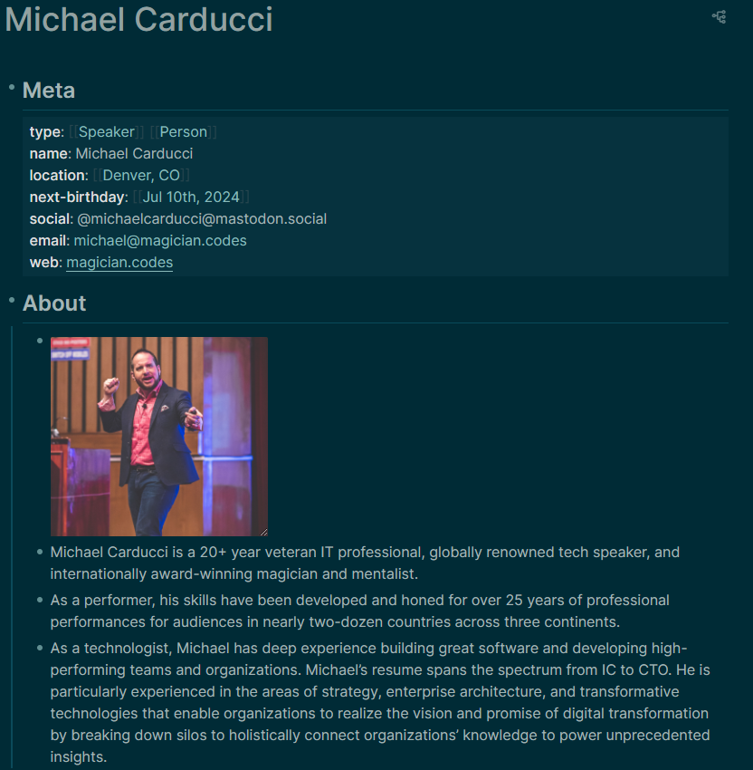
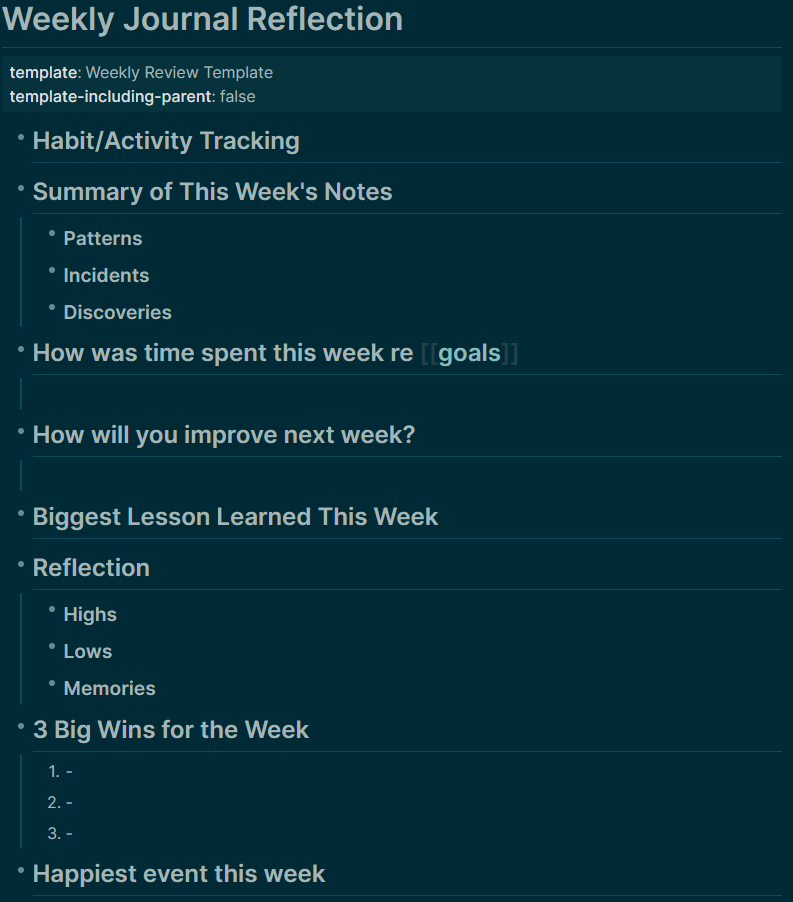

## Meta
Type:: [[Project]]
Status:: [/[Planned]] [[Active]] [/[Completed]] [/[Archive]]
Team:: 
Lead:: 
Goals:: Learn the basics of Logseq and PKM practices 
Start:: [[Aug 14th, 2024]] 
End:: [[Aug 14th, 2024]] 
areas:: 
Tags:: [[PKM]]
- ## Objective
	- > Join us for a transformative hands-on workshop on Personal Knowledge Management (PKM), designed specifically to empower developers, architects, and knowledge workers alike to master information in this information age. Based on Tiago Forte's Building a Second Brain methodology and implemented using the Logseq PKM application, this course aims to equip attendees with the strategies, tools, and insights to streamline their knowledge management, increase productivity, and stimulate creativity. Attendees will learn to construct a personal knowledge graph, effectively annotate and reference digital assets, manage tasks, journal for success, leverage templates, and much more. The ultimate goal is to create a personalized system that enables you to instantly find or recall everything you know and learn.
- ## Scope
	- 1-Day workshop
- ## Project Kickoff Checklist
	- DONE Download and Install Logseq
	- DONE Clone the repo that is [here](https://github.com/carducci/logseq-demo-graph)
- ## Tasks
	- query-table:: false
- ## Labs
	- ### LATER Lab 2 (Markdown Practice) [[Aug 14th, 2024]]
		- Navigate to [[Michael Carducci]]
		- LATER duplicate this structure using raw markdown
			- 
	- ### LATER Lab 3 (plugins)
		- Instructions: ((655a678c-3457-4285-8390-d40ec1018315))
		  :LOGBOOK:
		  CLOCK: [2024-05-10 Fri 07:00:16]--[2024-05-10 Fri 07:00:17] =>  00:00:01
		  :END:
			- LATER Bullet Threading
			- LATER Journals Calendar
			- LATER Logseq Markmap
			- LATER Tabs
			- LATER Todo List (ahonn)
			- LATER Helium
			- LATER logseq-pomodoro-timer
	- ### LATER Lab 4 (Templates)
		- LATER review [[template]] page
		- LATER Add Weekly Reflection template (duplicate this structure)
			- {:height 509, :width 428}
		- LATER Add template with prompts for another useful template in your daily work
		- LATER Apply the Daily Journal template to your current Journal Page
	- ### LATER Lab 5 (Tasks)
	  collapsed:: true
		- Navigate to your Daily Journal
		- LATER Add a heading of Stuff I know I need to do
		- LATER Brain-Dump Tasks
			- Bonus points for piority, due-date, and links
	- ### LATER Lab 6 (Projects, Areas, Resources)
		- LATER Create stub project pages using template for current project
		- LATER Create stub Areas using template for current areas
		- LATER Create stub Resources using templates for current resources
		- LATER Review PARA queries under Favorites
	- ### LATER Lab 7 (Meetings)
		- LATER Create example meeting page using meeting template
		- LATER Add action items to the meeting under a project link
		- LATER Review project page for action items
		- LATER Create example 1:1 page using 1:1 template
		- LATER Add action items under a team member link
	- ### LATER Lab 8 (Managing Assets)
		- LATER Download Slide Deck [here](https://magician.codes/assets/pkm-workshop.pdf)
		- LATER Upload asset under Resources on this page (using the `/upload an asset` command)
		- LATER Capture one or more highlights between slide 1 and Slide 14 and add highlight to "notes" section, adding some context or take-aways from that content below the highlight
	- ### LATER Lab 9 (Video)
	  collapsed:: true
		- LATER find an educational video you'd like to learn from in the future
		- LATER embed the video in Logseq (Under a topic on your Daily Journal)
		- LATER Try out helium
		- LATER Embed a youtube timestamp
	- ### LATER Lab 10 (Books)
	  collapsed:: true
		- LATER Create 3 concrete instances of books you want to read
		- LATER Create 3 concrete instances of books you've read
		- LATER At at least one book you're currently reading
		- LATER review [[Reading List]]
	- ### LATER Lab 12 (flashcards)
	  collapsed:: true
		- LATER Review flashcards on [[logseq]]
		- LATER Review flashcards on [[Markdown]]
		- LATER Create a page for a topic you are interested in and create some flashcards
		- LATER create a flashcard query on that page.
	- ### LATER Lab 13 (Team Members)
		- LATER Create a new page for each member of your team and your Manager
		- LATER Apply the Team Member template to each
		- LATER Complete prompts for each team member
		- LATER Review team member tasks under the team member page
	- ### LATER Lab 14 (Queries)
		- LATER Create page for People
		- LATER Create a query for team members
		- LATER Modify query properties
		- LATER Add page to favorites (right-click on the page title)
- ## Resources
	- [[Logseq]]
	- [[Markdown]]
	- Upload slides here
- ## Notes